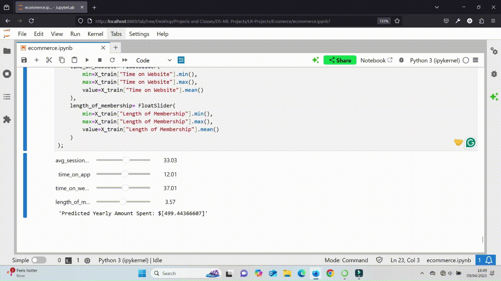

# Simple and Multiple Linear Regression Model without F Regression

<!-- TABLE OF CONTENTS -->

## Table of Contents

- [Overview](#overview)
- [Tools](#tools)
- [Contact](#contact)

<!-- OVERVIEW -->

## Overview

In this project I analysed one of the datasets on [Kaggle](<https://www.kaggle.com>) centered on ecommerce data. The [dataset](https://medium.com/r/?url=https%3A%2F%2Fwww.kaggle.com%2Fdatasets%2Fkolawale%2Ffocusing-on-mobile-app-or-website) contained 500 rows and  8 columns of data. The columns included in the dataset were the E-mail, address, avatar, average session length, time on the app, time on the website, length of membership, and the yearly amount spent. I created a simple and multiple linear model to predict the yearly amount spent by various customers.

## Tools

- [Pandas](https://pandas.pydata.org)
- [Matplotlib](https://matplotlib.org)
- [Plotly](https://plotly.com/)
- [Seaborn](https://seaborn.pydata.org)
- [Sklearn](https://scikit-learn.org/stable/user_guide.html)
- [pylab](https://matplotlib.org/stable/api/pylab.html)
- [scipy](https://docs.scipy.org/doc/scipy/)
- [ipywidgets](https://ipywidgets.readthedocs.io/en/stable/)

## Contact

- GitHub [@Sotun-1010](https://github.com/Sotun-1010)
- Twitter [@O_G_Sotun](https://twitter.com/O_G_Sotun?t=kRiO1YNhYKn8NJJnxTZ42A&s=03)
- Portfolio Site [Ogunjirin Oluwasotun](https://www.datascienceportfol.io/oluwasotunogunjirind)
- Medium [Ogunjirin Oluwasotun Goodness](https://medium.com/@oluwasotunogunjirin)
- Website [Oglytics](https://oglytics.webflow.io/)
